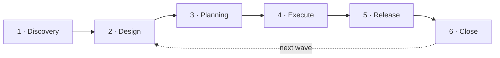
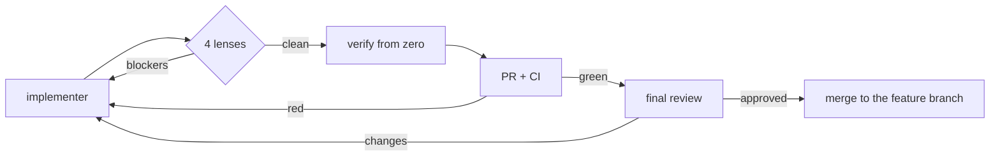

# skills

An opinionated, stage-gated development pipeline for AI agent teams —
built as [Claude Code](https://claude.com/claude-code) skills, agents,
and workflows, extracted from production use at a real software
company and published as-is.

**This is not a framework.** It is one team's working pipeline, made
public because the ideas travel even where the specifics don't. It
does not try to be configurable — it is deliberately opinionated, and
the intention is that you read it, steal what fits, and shape your
own; not that you adopt it wholesale. The best way to use it: **fork
it and keep editing** — bend every rule toward what serves your team,
with this model as your starting base, never as absolute truth. Even
here it isn't treated as one: the closing stage exists precisely to
keep rewriting these files as reality pushes back.

## How it works

One demand becomes a **workstream**: one folder, one conducting Claude
Code session, one **blueprint** (a single self-contained HTML artifact
the human reviews on — same URL from discovery to done, growing a tab
per stage). The demand travels through six stages; each stage is a
skill that conducts the session, and each ends at an **explicit human
checkpoint** — the pipeline runs autonomously between gates, never
through them.



Underneath, four mechanics carry everything:

- **The session conducts; agents work.** The session dispatches,
  routes, audits, and talks to the human — it never writes the
  deliverables. Authors write, reviewers judge; every agent is a file
  in `agents/` with five fixed sections. Stage 4 is the one stage that
  is several sessions: a master, one worker session per repo, one
  environment session — peers that message each other, because only
  a session can launch a workflow.
- **State is 100% external.** The workstream folder, GitHub as the
  source of record, the board as a projection. Any agent — even a
  conductor mid-stage — can die and be re-dispatched: it re-derives
  everything from the source and continues. Nothing lives in memory.
- **Reviews are workflows, not discipline.** Every review round is a
  deterministic script in `workflows/` — all reviewers, every round,
  structured outputs, lazy passes re-dispatched automatically. There
  is no code path that runs a subset, so skipping review is not a
  temptation an agent can act on.
- **Every reviewer answers one contract.**
  [reviewer-contract.md](docs/standards/reviewer-contract.md): verdict
  derived arithmetically from the worst finding, verbatim proof of
  reading, and the rule that a clean pass without a verification trail
  is invalid.

## The six stages

**1 · Discovery** — the demand is interviewed into a PR-FAQ and user
stories: what gets built, what stays out, every acceptance criterion
with an ID. Two **blind readers** then describe what they would build
from the documents alone — where their builds diverge, the text is
ambiguous, and a judge turns real divergence into findings. The
business side reviews one package, once. In the ideal world, this
stage isn't run *for* the business team but *by* it — the skill
interviews whoever owns the demand, and engineering only enters at
stage 2 with the ambiguity already wrung out.

**2 · Design** — the architect cuts the demand into **waves**
(wave 1 is the smallest thing useful end to end) and designs the
current one: dedicated research per external target, architecture,
data, contracts (the frozen bridge everything downstream stands on),
the UI authored as artboards on a design canvas, security, infra,
observability, rollout. Ten review lenses try to break it.

**3 · Planning** — one plan author per repo decomposes the design
into **cold-executable issues**: each issue is the complete brief for
an implementer with zero conversation context. Three deliberately
weak blind readers read each issue as that cold worker would; a judge
treats their divergence as the ambiguity signal. The bar: if a weak
model can execute it, the real one certainly can. On approval, the
issues are bootstrapped to GitHub.

**4 · Execute** — build it and prove it works, internally. Per repo,
a worker session drives issues through the per-issue engine; per
wave, an environment session deploys the feature branches to staging,
runs the deterministic smoke suite, and drives the **all-or-nothing
e2e round** — one failing case dirties the whole round, and after
fixes the entire round runs again. The master session routes between
them and talks to the human. Nothing here touches main, and prod does
not exist.



Every fix — a lens blocker, a red CI, a rejected review — re-enters
the same loop: **no commit reaches the PR without passing the
lenses.** The verification step re-runs every gate from scratch
(declared evidence is never trusted evidence), and the final review
is a fresh, contextless read of the whole PR, its verdict posted on
the PR itself.

**5 · Release** — now that it provably works, put it in the air
safely. Two human gates (entry, and prod-go). The integration train
runs producer-first in two lanes — a front whose hosting auto-builds
prod from main merges only after its producers are live, because its
merge IS its deploy. Staging is redeployed from the integrated main
and re-smoked before prod opens. Versions are **semver derived
mechanically from conventional commits**; tags are never retroactive
— prod deploys from the tag. The cutover is supervised step by step,
and no prod command runs before that repo's rollback plan is written.

**6 · Close** — the wave archives itself and the pipeline learns.
Every friction noted during the run is judged: **class, not
incident** — what doesn't generalize is discarded with a reason.
Pipeline-class lessons become direct edits to these very files, one
revertible commit each, inside a declared autonomy boundary
(topology, cost, human gates, prod, and product decisions always
escalate to the human). Then the next wave opens, or the workstream
is done.

## The standards are the configuration surface

Everything in `docs/standards/` was written for **our** stack and
taste — TypeScript everywhere, serverless AWS with CDK, 100% coverage
as a physical threshold, one error envelope, comments as a last
resort. Yours are probably different, and that is the point of the
architecture: agents never carry rules inline — they **point** at the
standards, one source file per subject:

| Standard | Governs |
|---|---|
| [code.md](docs/standards/code.md) | how code is written — typing, architecture, readability, comments, the CDK pattern |
| [testing.md](docs/standards/testing.md) | the proof ladder — unit rules, the smoke suite, the e2e round |
| [repo-structure.md](docs/standards/repo-structure.md) | one tree per repo type, canonical npm scripts, the build guard |
| [ci.md](docs/standards/ci.md) | the standardized pipeline, branch protection, the CD seam |
| [git.md](docs/standards/git.md) | atomic conventional commits, branch names, merges by intention |
| [docs.md](docs/standards/docs.md) | the living docs tree every repo keeps |
| [error-envelope.md](docs/standards/error-envelope.md) | the one error shape across every API |
| [observability.md](docs/standards/observability.md) | alarms with runbooks, structured logs |
| [architecture.md](docs/standards/architecture.md) | platform services, event-driven by default |
| [reviewer-contract.md](docs/standards/reviewer-contract.md) | how every reviewer in the pipeline answers |

Rewrite any of these to say **your** rules, and every implementer,
every review lens, and every conductor reflects them on their next
run — no agent needs touching. The standards are where this pipeline
is meant to be edited.

## On cost

This pipeline is expensive to run today, and that was a deliberate
non-concern. Every diff is read whole by four reviewers plus an
independent verifier plus a strong final reviewer; every review round
re-runs in full after every fix; ambiguity is hunted by dispatching
multiple readers at the same document. That redundancy is exactly
where the quality comes from — and it is priced in tokens.

We optimized for the trendline, not the invoice: models keep getting
better and cheaper, and a pipeline built around abundant intelligence
ages well along that curve. Where the ratio hurts you today, the
levers are obvious — smaller models on the evidence lenses, fewer
readers, narrower rounds — but they are yours to pull, not defaults
we chose.

## Layout

```
skills/        one folder per stage — SKILL.md + templates + references
agents/        every agent, named <stage>-<role>[-<lens>], five fixed sections
workflows/     the deterministic review rounds and engines (plain JS, single-file)
docs/
  standards/   the single-source rulers everything points at
```

## Installing into a project

Shared across projects by symlink — each project keeps its own
settings, MCP config, and machine tuning; the pipeline stays one
source:

```bash
git clone https://github.com/farias-77/skills.git ~/skills
cd <your-project>/.claude
ln -s ~/skills/skills skills
ln -s ~/skills/agents agents
ln -s ~/skills/workflows workflows
ln -s ~/skills/docs docs
```

What the pipeline expects from its surroundings:

- **Claude Code**, with the `gh` CLI authenticated — GitHub is the
  source of record.
- A **Linear MCP** connection if you want the board projection — the
  stages treat its absence as a halt by design; strip those lines if
  you track elsewhere.
- Project specifics — environments, credentials, deploy targets, the
  build-guard slot count — live in **your** project's `CLAUDE.md`,
  never in these files.

## Glossary

| Term | Meaning |
|---|---|
| **workstream** | one demand, end to end — one folder, one blueprint, one conducting session |
| **wave** | a shippable slice of the demand; wave 1 is the smallest thing useful end to end |
| **blueprint** | the workstream's single review artifact — one URL, tabs per stage, pills per wave |
| **conductor** | whoever dispatches and audits without doing the work — the stage's session, or one of stage 4's worker / environment sessions |
| **lens** | a reviewer scoped to one failure mode |
| **blind reader** | an agent that reads alone, so divergence from its sibling exposes ambiguity |
| **andon** | stop before building on a broken premise — a cheap halt beats wrong work |
| **dreaming** | the closing pass where frictions become edits to the pipeline itself |

## License

[MIT](LICENSE). Take what serves you.
