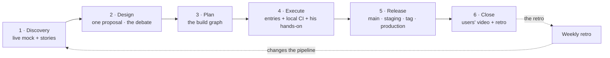

# skills

An opinionated, stage-gated development pipeline for AI agent teams,
built as [Claude Code](https://claude.com/claude-code) skills, agents
and workflows, extracted from production use at a real software
company and published as-is.

**This is not a framework.** It is one team's working pipeline, made
public because the ideas travel even where the specifics don't. Read
it, steal what fits, and shape your own. The best way to use it is to
**fork it and keep editing**: the weekly retro exists to keep
rewriting these files as reality pushes back.

## What it is

A software factory for a team of one: a person says what to build, and
a crew of agents turns it into tested, reviewed, released code, with a
report he can watch at every stage. Several fronts run at once, through
the night, and he is asked only what is his.

| Rule | What it means |
|---|---|
| **Proof over opinion** | a live mock he clicks, ACs that become tests, a gate, QA on the running app; reviewers exist for what cannot be run |
| **Right size** | one proposal sized to the problem, an overengineering guard whose only job is to cut, an evolution path for what was left out; "could be simpler" never blocks |
| **One round** | every review runs once; a fix is verified by reading or by the delta, never by a second round |
| **He is asked only what is his** | the conductor decides his class conservatively and lists it for veto; only a locked AC changed, a new recurring cost or something irreversible becomes a question |
| **A report he can watch** | one link per front: each stage gets a Video, a Deck and an Explainer, finished before the stage closes |
| **Local CI, one guard** | the whole gate runs on our compute and posts the status `main` requires; a hook denies what cannot be undone |
| **It measures itself** | a script reads time, cost and his touches per stage; the weekly retro turns what repeats into changes he rules |

## One door, three routes

```
/lets-cook <idea> ──► scouts in the background ──► a light interview ──► the route, in one line
  ├─ full    ──► the six stages below
  ├─ short   ──► one-page brief ──► ! authorize + /goal ──► one entry ──► his use ──► release ──► short close
  └─ hotfix  ──► brief + a test that reproduces the bug ──► ! authorize + /goal ──► one entry ──► release
```

Every route keeps every check (builder, gate, reviewer and QAs, local
CI, staging, tag, watch); only the ceremony shrinks.

## The six stages


```mermaid
flowchart LR
  D1["1 · Discovery<br/>live mock + stories"] --> D2["2 · Design<br/>one proposal · the debate"]
  D2 --> D3["3 · Plan<br/>the build graph"]
  D3 --> D4["4 · Execute<br/>entries + local CI + his hands-on"]
  D4 --> D5["5 · Release<br/>main · staging · tag · production"]
  D5 --> D6["6 · Close<br/>users' video + retro"]
  D6 -. "the retro" .-> W["Weekly retro"]
  W -. "changes the pipeline" .-> D1
```

Each stage opens with **the canary** (the guard must deny `git push
origin a:b`) and, except discovery, hands him **one `/goal`**; then it
runs on its own to its close. It closes with its report published and
the next play: `/clear`, then `/stage-<next> <slug>`. Every session
runs on Opus 5.5, high.

| Stage | What happens | His part |
|---|---|---|
| **1 · Discovery** | while he talks, `prototype-builder (Sonnet 5.5, medium)` turns each answer into a visible edit of a live mock; the conductor locks it when nothing is open; `story-writer (Sonnet 5.5, high)` writes the stories, one AC per rule; one review round (`discovery-review-workflow.js`: three `disc-lens (Sonnet 5.5, medium)` and, per story, two `blind-reader (Sonnet 5.5, low)` and a `blind-judge (Sonnet 5.5, medium)`) | the conversation; the playback, story by story |
| **2 · Design** | scouts read the system; `architect (Opus 5.5, high)` writes one proposal with its v1 → v2 → v3 path; `overengineering-guard (Opus 5.5, medium)` cuts; after his "closed", the architect writes `solution.md` and five `design-writer (Sonnet 5.5, high)` the other documents; four lenses review once, called directly by the session: `design-consistency` and `design-security` (Opus 5.5, medium), `design-contracts (Sonnet 5.5, high)`, the guard again | the debate over a deck and a ≤60 s video, until "closed" |
| **3 · Plan** | `planner (Opus 5.5, high)` cuts the widest graph: a thin contract commit C, entries of one whole behaviour (≤12 ACs) with front and back in parallel, E-int last; `plan-writer (Sonnet 5.5, high)` writes one brief per node; one round (`plan-review-workflow.js`: `plan-reviewer (Opus 5.5, medium)` and the double-blind per brief); the session rules everything and writes the pre-flight | nothing; a veto list at the close |
| **4 · Execute** | the session is the tech lead. Every ready entry runs `exec-entry-workflow.js`, in its own cloud session when the project has one: `builder-backend` ∥ `builder-frontend (Opus 5.5, medium)` → `exec-gate (Sonnet 5.5, low)` → `reviewer (Opus 5.5, high)` ∥ `qa-frontend` · `qa-backend (Opus 5.5, medium)` by surface → one fix pass → the delta. A serial queue merges into `feat/<slug>`; the project's signoff command runs the whole gate and posts `local-ci` | the pre-flight; his hands-on with the running app, each answer an `A.n` round, until "ok" |
| **5 · Release** | merge into `main` behind `local-ci`; the CI deploys staging and smokes; a `vX.Y.Z` tag promotes the same image to production, smokes, watches 15 minutes and rolls back on its own. A red gets one fix entry; a second red stops | his authorization line; a question only on the stop list (a new production deploy after a rollback is one) |
| **6 · Close** | the users' video (1–3 min, recorded on staging) and a "what's new" text he forwards; a short retro with the script's numbers; a script proves nothing of the front is left on the machine | nothing |

The **weekly retro** reads the week's closed fronts together and
proposes changes, each with its evidence and exact edit; he rules each
one (apply · park · drop). It is the only place the pipeline changes.

## The roster

Every agent is a file under `claude/agents/`. Only **Opus 5.5** and
**Sonnet 5.5** are used: Opus where judgment pays (architecture, the
cut, code, review, QA, the risk lenses), Sonnet for literal reading
and templated writing, never above high.
[docs/models.md](docs/models.md) holds the evidence for each pick;
`node scripts/check-models.mjs` fails when an agent disagrees with it.

| Stage | Agent | Model, effort |
|---|---|---|
| all | `scout` | Sonnet 5.5, low |
| every report | `video-builder` | Sonnet 5.5, high |
| every report | `slides-builder` · `artifact-builder` | Sonnet 5.5, medium |
| discovery, plan | `blind-reader` | Sonnet 5.5, low |
|  | `blind-judge` | Sonnet 5.5, medium |
| discovery | `prototype-builder` | Sonnet 5.5, medium |
|  | `story-writer` | Sonnet 5.5, high |
|  | `disc-lens` | Sonnet 5.5, medium |
| design | `architect` | Opus 5.5, high |
|  | `overengineering-guard` | Opus 5.5, medium |
|  | `design-writer` | Sonnet 5.5, high |
|  | `design-consistency` · `design-security` | Opus 5.5, medium |
|  | `design-contracts` | Sonnet 5.5, high |
| plan | `planner` | Opus 5.5, high |
|  | `plan-writer` | Sonnet 5.5, high |
|  | `plan-reviewer` | Opus 5.5, medium |
| execute | `builder-backend` · `builder-frontend` | Opus 5.5, medium |
|  | `exec-gate` | Sonnet 5.5, low |
|  | `reviewer` | Opus 5.5, high |
|  | `qa-frontend` · `qa-backend` | Opus 5.5, medium |

## The skills

| Skill | Runs as | What it does |
|---|---|---|
| `lets-cook` | session | the one door: interview, route, and the short route and hotfix end to end |
| `stage-discovery` · `stage-design` · `stage-plan` · `stage-execute` · `stage-release` · `stage-close` | session | the six stages |
| `weekly-retro` | session | the week's fronts read together; the only place the pipeline changes |
| `pipeline-setup` | session | audits a project against the bar and closes the cheap gaps on a branch |
| `draw-it-for-me` | preloaded by `artifact-builder`, `prototype-builder` | explanatory pages: diagrams that build, motion, 3D, charts |
| `pitch-it-for-me` | preloaded by `slides-builder` | HTML slide decks, one idea per slide |
| `make-it-a-movie` | preloaded by `video-builder` | motion films written as one TSX file on the video kit, rendered once |
| `i-wont-read-all-this` | always on | replies shaped for a reader who skims |

Each skill folder has its own `README.md`: what it does, how to install
only it, its files. Knowledge lives in each skill's `references/`.

## The workflows

| Workflow | Stage | Runs | Dry run |
|---|---|---|---|
| `discovery-review-workflow.js` | discovery | three lenses ∥ the double-blind per story | `scripts/discovery-review-dry-run.mjs` |
| `plan-review-workflow.js` | plan | the plan reviewer ∥ the double-blind per brief | `scripts/plan-review-dry-run.mjs` |
| `exec-entry-workflow.js` | execute, release, lets-cook | one entry: builders → gate → reviewer ∥ QAs → triage → one fix → the delta; modes `build`, `resume`, `update`, `fix` | `scripts/exec-entry-dry-run.mjs` |

The design review needs no workflow: the session calls its four lenses
directly.

## The report

Each front has **one private link**: a rail of stages, each with
**Video · Deck · Explainer**, filled as each stage closes and finished
before it does. The shell is `claude/report/shell.html` plus a
`report.json`; the video kit (`claude/video/`) renders a TSX film on
its motion library into an MP4; the decks are HTML slides. The short
route's rail is Build · Release · Close. See
[docs/stage-report.md](docs/stage-report.md).

## Local CI and the guard

- **The CI is local.** The project's signoff command runs the whole
  gate in a clean worktree on our compute and, only on exit 0 and
  under a bot identity, posts the `local-ci` status `main` requires.
  `claude/scripts/local-ci.sh` is the generic fallback. Hosted CI keeps
  the deploys and the environments.
- **One guard.** `claude/hooks/guard-irreversible.sh` is a PreToolUse
  hook on Bash and every file tool, installed behind a fail-closed
  wrapper: it denies the irreversible (destroying infrastructure,
  deleting data, force-push, a forged status, reading the CI token,
  switching identity, edits to itself), and any merge into `main` or
  `v*` tag that his authorization line does not cover.
  `claude/hooks/authorize.sh` writes that line; only he runs it, as
  `! .claude/hooks/authorize.sh …`.

## The bar and `/pipeline-setup`

The pipeline is generic: it reads the stack, the commands and the
taste from the project. [docs/project-contract.md](docs/project-contract.md)
is the bar, written as roles in three levels: required (standards,
golden paths, the gates, a stack per worktree, the release roles, the
permissions and the guard, the local-CI signoff, the mock toolchain,
the smoke), recommended, and for the full experience (a cloud
environment for entries, the video toolchain).

Run **`/pipeline-setup <path-to-project>`** first. It audits the
project with scouts reading a detached worktree at the default
branch's sha, writes `pipeline-readiness.md` (present · partial ·
missing, each with its evidence) on a setup branch, proposes the
cheapest order to close the gaps, and applies the generic pieces on
that branch when you say so: the settings, the guard and
`authorize.sh`, the structure check, the cloud templates. What is the
user's alone (branch protection, the bot identity, anything with a
secret) is listed with a ready command, never run.

## Install

Shared across projects by symlink; each project keeps its own settings:

```bash
git clone https://github.com/farias-77/skills.git ~/skills

cd <your-project>/.claude
ln -s ~/skills/claude/skills skills
ln -s ~/skills/claude/agents agents
ln -s ~/skills/claude/workflows workflows
```

Each stage reads the house rules (`CLAUDE.md` at the clone's root) at
its opening, so the project does not import them. Name the designs
root (where each front's folder lives) in the project's `CLAUDE.md`.
Then, in Claude Code inside the project:
`/pipeline-setup .`

- **Claude Code** with the `gh` CLI authenticated: GitHub is the
  source of record and the signoff's target.
- The Workflow tool resolves the symlink: add the clone to the
  project's settings (`permissions.additionalDirectories: ["~/skills"]`),
  or the workflows refuse to start (each stage also knows how to copy
  the script into the workstream and run the copy).
- On the station: Node (current LTS), `ffmpeg` and `npm ci` in
  `claude/video/` for the reports; `playwright-core` and a Chromium for
  discovery's mock (`PLAYWRIGHT_DIR`, `PROTO_CHROME`); `gitleaks`.
- Project specifics (environments, credentials, deploy targets) live
  in **your** project's `CLAUDE.md` and standards, never in these files.

## Layout

```
CLAUDE.md               the house rules every stage follows
claude/
  GLOSSARY.md           one line per term
  references/           judging.md: the one rule for every review
  skills/               one folder per skill: SKILL.md, README.md, references/, templates/, scripts/
  agents/               every agent, its model and effort in the frontmatter
  workflows/            <name>-workflow.js: the multi-agent rounds, plain JS
  hooks/                guard-irreversible.sh, authorize.sh, their tests
  scripts/              local-ci.sh (the fallback signoff), telemetry.mjs, cleanup.sh
  report/               the report shell, the template explainer, a working example
  video/                the video kit (Remotion): the motion library, render.sh
docs/                   the bar, models.md, the stage report, testing the pipeline
scripts/                check-models.mjs; the workflows' and local-ci's dry runs
codex/                  a placeholder
```

Terms are in [claude/GLOSSARY.md](claude/GLOSSARY.md).

## License

[MIT](LICENSE). Take what serves you.
