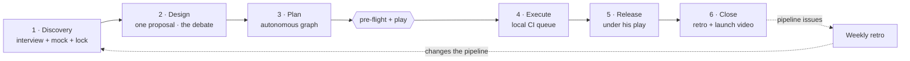

# skills

An opinionated, stage-gated development pipeline for AI agent teams —
built as [Claude Code](https://claude.com/claude-code) skills, agents
and workflows, extracted from production use at a real software
company and published as-is.

**This is not a framework.** It is one team's working pipeline, made
public because the ideas travel even where the specifics don't. It is
deliberately opinionated: read it, steal what fits, and shape your own.
The best way to use it is to **fork it and keep editing** — the
closing stage exists precisely to keep rewriting these files as
reality pushes back.

## What it is

A software factory for a team of one: a person says what to build,
and a crew of agents turns it into tested, reviewed, released code
with a launch video at the end. Six rules hold at every stage:

| Rule | What it means |
|---|---|
| **Proof over opinion** | whatever can be checked by running something is: a clickable mock, journeys that become tests, a gate, QA on the running app. Reviewers exist for what cannot be run |
| **Right size, always** | one proposal at the "basics done well" bar, a critic whose only job is to cut, and an evolution path for what was relaxed; every mechanism names the AC or the risk that forces it |
| **Specialists with knowledge packs** | each agent reads the packs of its craft before it works |
| **He is asked only what is his** | he is in the loop at discovery and in the design debate; plan, execute and release run from play to done. What needs him in person is gathered up front, in one pre-flight message |
| **Three layers per stage** | every stage reports as a video, then slides, then the blueprint |
| **The pipeline measures itself** | each stage records its time, his minutes, agent hours, tokens, rounds and findings; the retro turns what went wrong into pipeline issues |

One demand becomes a **workstream**: one folder, one conducting Claude
Code session per stage, one **blueprint** (a single self-contained HTML
page, the same URL from discovery to done, a tab per stage, built from
JSON the stages write and never edited by an agent). State lives in
files, never in a session's memory: any session can `/clear` and
resume from the workstream's `.state.md`.

## The six stages


```mermaid
flowchart LR
  D1["1 · Discovery<br/>interview + mock + lock"] --> D2["2 · Design<br/>one proposal · the debate"]
  D2 --> D3["3 · Plan<br/>autonomous graph"]
  D3 --> PF{{"pre-flight + play"}}
  PF --> D4["4 · Execute<br/>local CI queue"]
  D4 --> D5["5 · Release<br/>under his play"]
  D5 --> D6["6 · Close<br/>retro + launch video"]
  D6 -. "pipeline issues" .-> W["Weekly retro"]
  W -. "changes the pipeline" .-> D1
```

**1 · Discovery — the interview builds the mock.** The demand's owner
says everything that needs to be built while a clickable mock of it is
built in front of him: exact in look (the project's exported tokens
and components) and in behaviour (every screen and state, realistic
data, a faked store whose side effects show in a backstage pane). A
journey panel plays each journey step by step; he validates through
it. His "lock it" is the gate: the lock walks every journey and state
once more and freezes the frames. From the locked mock, the journeys
(YAML a test can run), the use cases and the acceptance criteria
(`J1.s2.1 [RULE] GIVEN/WHEN/THEN`, one per rule and one per behavior)
are derived by `journey-scribe (Sonnet 5.5, high)`, plus a one-page
PR-FAQ. One review round (`disc-reviewer (Sonnet 5.5, medium)` and a
`disc-blind-reader (Sonnet 5.5, low)` per story, filtered), verified
by reading: no second round, no delta. The report's video is the mock
in use, 60–90 s.

**2 · Design — one proposal, debated until closed.** Scouts (`scout
(Sonnet 5.5, low)`) read the current system; he is asked what he has
in mind. One `architect (Opus 5.5, high)` writes one proposal at the
"basics done well" bar, with where it disagrees with him and the
evolution path; `overengineering-critic (Opus 5.5, medium)` cuts what
serves no AC and no real risk. The proposal is presented as a video
and slides and debated with him until he says it is closed, the slides
re-rendered each round. Then four `design-writer (Sonnet 5.5, high)`
in parallel write `solution.md`, `data-and-contracts.md` (with a
Contract per feature), `tests.md` (one primary proof per AC) and
`operations.md`, about 40 KB each; one `design-reviewer (Opus 5.5,
medium)`, one round, blocking findings only (AC coverage, consistency,
security posture).

**3 · Plan — no user in the loop, maximum width.** From A (what the
scouts find today and what the other running fronts are changing) to B
(what the design says exists), as a build graph a script checks
(`plan.graph.json`). Compute is infinite: one `planner (Opus 5.5,
high)` cuts the most parallel graph — a thin foundation, every entry
one whole behaviour built at once, front and back in parallel on the
design's Contract, hot files made cold, an edge only where nothing can
be faked, one integration entry at the end. `plan-writer (Sonnet 5.5,
high)` writes one brief per entry, all at once; one review round
(`plan-reviewer (Opus 5.5, medium)` and a `plan-blind-reader (Sonnet
5.5, low)` per brief, filtered). The conductor rules everything and
lists its choices for veto; the pre-flight lists what only he can hand
over, each item with a ready command. Stage 4 waits for his play.

**4 · Execute — play, and come back to use it.** He hands over
the pre-flight and pastes one goal; he is called once, at the end.
Done means the plan's ACs met and the gate green; nothing else blocks.
Per node: one `builder (Opus 5.5, medium)` writes the code and a test
per AC (two, back and front in parallel, when the brief fixes the
contract), running only the fast checks; the gate runs the suites
once; then, in parallel, one `reviewer (Opus 5.5, high)` and the QAs
of the surface (`qa-frontend`, `qa-backend`, both Opus 5.5, medium),
none of whom wrote the code. A finding blocks only on an AC not met, a
reproduced bug, a security hole or a written rule broken; the rest are
notes on the PR. One fix pass at most, then the entry merges or parks.
The session is the **local CI**: a serial queue tests each merged tree
and signs it off; the whole gate runs once at the end. Then his
hands-on: the session runs the environment, he uses the app and says
what to change in plain words, and each adjustment is built on the
spot (builder, gate, merge; the reviewer only when it touches auth,
permissions or personal data) until he says ok.

**5 · Release — autonomous, responsible.** Stage 4 owns working, so
the release does not re-test the feature. His play is his "go": one
message carries the pre-flight and the play line that authorizes the
audited head. Then the session merges into `main` behind the local-CI
signoff, deploys staging and smokes the read-only journeys there,
ships production progressively where the platform allows (a candidate
at 0% smoked on its tag, then the shift), smokes it, and watches
errors and latency for 15 minutes, rolling back on its own on the
triggers it wrote before the play. A red gets one fix through the
stage-4 pipeline; a second red stops and reports. A guard hook holds
whatever cannot be undone.

**6 · Close — the retro for the pipeline, the launch for the people.**
The retro harvests the whole record (what worked, what went wrong, the
metrics, the structure of `main` before and after) into pipeline
issues for the weekly retro, the only place the pipeline changes. For
the product's users and the team, a launch director plans a film, a
recorder captures the real app journey by journey, and the video kit
renders a portfolio-grade launch video with a tutorial per feature,
plus a "what's new" text.

## The roster

Every agent is a file under `claude/agents/`, and every mention of one
carries its model and effort. Only **Opus 5.5** and **Sonnet 5.5** are
used: Opus at medium writes the most mergeable code and judges more
precisely; Sonnet reads literally and fills templates fast. The table
below is generated from [docs/models.md](docs/models.md), which holds
the evidence for each pick; `node scripts/check-models.mjs` fails when
an agent's frontmatter disagrees.

| Session | Model, effort |
|---|---|
| discovery conductor | Opus 5.5, medium; high on the turns that rule |
| design, plan conductors · execute session | Opus 5.5, high |
| release, close sessions · `/pipeline-setup` | Opus 5.5, medium |

| Stage | Agent | Model, effort |
|---|---|---|
| all | `scout` | Sonnet 5.5, low |
|  | `video-scribe` | Sonnet 5.5, medium |
|  | `slides-scribe` | Sonnet 5.5, high |
| discovery | `prototyper` | Opus 5.5, medium |
|  | `journey-scribe` | Sonnet 5.5, high |
|  | `disc-author-prfaq` | Sonnet 5.5, high |
|  | `disc-reviewer` | Sonnet 5.5, medium |
|  | `disc-blind-reader` | Sonnet 5.5, low |
| design | `architect` | Opus 5.5, high |
|  | `overengineering-critic` | Opus 5.5, medium |
|  | `design-researcher` | Sonnet 5.5, medium |
|  | `design-writer` | Sonnet 5.5, high |
|  | `design-reviewer` | Opus 5.5, medium |
| plan | `planner` | Opus 5.5, high |
|  | `plan-writer` | Sonnet 5.5, high |
|  | `plan-reviewer` | Opus 5.5, medium |
|  | `plan-blind-reader` | Sonnet 5.5, low |
| execute | `builder` | Opus 5.5, medium |
|  | `exec-gate` | Sonnet 5.5, low |
|  | `reviewer` | Opus 5.5, high |
|  | `qa-frontend` | Opus 5.5, medium |
|  | `qa-backend` | Opus 5.5, medium |
| release | `release-scribe` | Sonnet 5.5, medium |
| close | `close-harvester` | Sonnet 5.5, medium |
|  | `launch-director` | Opus 5.5, high |
|  | `footage-recorder` | Sonnet 5.5, medium |

## Knowledge packs

A pack is a reference-only skill (`claude/skills/pack-<name>/`, with
`user-invocable: false`): a checklist plus recipes for one craft,
never an essay. Registered agents preload theirs through `skills:` in
their frontmatter; agents run inline by a workflow get each pack's
path in the prompt; a session loads one with the Skill tool.

| Pack | Read by |
|---|---|
| `design-taste` | prototyper (Opus 5.5, medium), builder (Opus 5.5, medium; screens) |
| `motion-3d` | prototyper (Opus 5.5, medium), builder (Opus 5.5, medium; screens), launch-director (Opus 5.5, high) |
| `interview-journeys-copy` | discovery conductor, prototyper (Opus 5.5, medium), journey-scribe (Sonnet 5.5, high), disc-author-prfaq (Sonnet 5.5, high), disc-reviewer (Sonnet 5.5, medium) |
| `right-sizing` | the design conductor, architect (Opus 5.5, high), overengineering-critic (Opus 5.5, medium) |
| `parallel-plan-local-ci` | the plan conductor, planner (Opus 5.5, high), plan-reviewer (Opus 5.5, medium), the execute session |
| `go-backend` · `react-frontend` | builder (Opus 5.5, medium), reviewer (Opus 5.5, high); go also qa-backend (Opus 5.5, medium), react also qa-frontend (Opus 5.5, medium) |
| `ops` | architect (Opus 5.5, high), builder (Opus 5.5, medium; ops), reviewer (Opus 5.5, high), the release session |
| `release` | the release session |
| `launch-video` | launch-director (Opus 5.5, high), footage-recorder (Sonnet 5.5, medium), the video kit's launch mode |
| `model-selection` | whoever picks a model: the evidence behind `docs/models.md` |

## Three layers per stage

Every stage closes with one report in three layers, read in order: a
**video** of one or two minutes on how the result works, **slides**
with the details one idea at a time, and the **blueprint** with
everything. He goes up one layer only when he wants more. The video kit
(`claude/video/`) renders a storyboard JSON to MP4 with no code per
video; the procedure is [docs/stage-report.md](docs/stage-report.md).
The close adds a different film: the launch video, for the people who
use the product.

## Local CI and the guard

- **The CI is local.** In execute the session is the only process that
  merges into the feature branch. Per node: the base comes in by a
  merge, the paths outside the node's owned files are listed, the
  merged tree passes the affected gate, it merges, and the signoff posts
  `local-ci/affected`. The whole gate runs once at the end in a fresh
  worktree and posts `local-ci`, the only context `main` requires.
  Hosted CI keeps the deploy.
- **One guard.** `claude/hooks/guard-irreversible.sh` is a PreToolUse
  hook on Bash and every file tool: it denies the irreversible
  (destroying infrastructure, deleting data, force-push, a forged
  status, edits to itself), asks before a secret's value is touched,
  and asks before a merge whose head his play did not authorize. That
  is why the merge and the production deploy can sit in `allow`.

## The bar and `/pipeline-setup`

The pipeline is generic: it reads the stack, the layout and the taste
from the project. [docs/project-contract.md](docs/project-contract.md)
is the bar, written as 22 **roles** in three levels — required (a
doctrine, golden paths, a gate that runs locally, a stack per
worktree, the structure check, the release roles, the permissions and
the guard, the local-CI signoff, the mock toolchain), recommended, and
for the full experience (autonomous release, progressive delivery, a
cloud runner, the video toolchain).

Run **`/pipeline-setup <path-to-project>`** first. It audits the
project against the bar with scouts reading a detached worktree at the
default branch's sha, writes `pipeline-readiness.md` (present ·
partial · missing, each with its evidence) and commits it on the setup
branch, never in your working tree, proposes the cheapest order to
close the gaps, and applies the generic pieces on that branch when you
say so — the settings template, the guard and its
tests, the local-CI script, the structure check. What is the user's
alone (branch protection, the autonomous posture, anything with a
secret) is listed with a ready command, never run.

## Install

Shared across projects by symlink — each project keeps its own
settings and machine tuning; the pipeline stays one source:

```bash
git clone https://github.com/farias-77/skills.git ~/skills

cd <your-project>/.claude
ln -s ~/skills/claude/skills skills
ln -s ~/skills/claude/agents agents
ln -s ~/skills/claude/workflows workflows
ln -s ~/skills/docs docs
```

Then, in Claude Code inside the project: `/pipeline-setup .`

What the pipeline expects around it:

- **Claude Code**, with the `gh` CLI authenticated: GitHub is the
  source of record and the signoff's target.
- The Workflow tool launches only a script it can read from the working
  directory or an added directory, and it resolves the symlink: add the
  clone to the project's settings
  (`permissions.additionalDirectories: ["~/skills"]`), or the workflows
  refuse to start.
- On the station: Node (current LTS), `ffmpeg` and the video kit's
  dependencies (`npm ci` in `claude/video/`) for the stage reports;
  `playwright-core` and a Chromium for discovery's mock
  (`PLAYWRIGHT_DIR`, `PROTO_CHROME`).
- Project specifics — environments, credentials, deploy targets — live
  in **your** project's `CLAUDE.md` and doctrine, never in these files.

## Layout

```
CLAUDE.md               the house rules every stage follows
claude/
  skills/               stage-*: one folder per stage (SKILL.md, templates, references, scripts);
                        pack-*: the knowledge packs; pipeline-setup; weekly-retro
  agents/               every agent, its model and effort in the frontmatter
  workflows/            deterministic multi-agent rounds (plain JS, single file each)
  hooks/                guard-irreversible.sh and its tests
  blueprint/            the blueprint shell, its build, strings per language, the JSON schemas
  video/                the video kit (Remotion): storyboard JSON → MP4, launch mode
docs/                   the bar, models.md, the stage report, the reviewer contract
scripts/                check-models.mjs
```

## On cost

The pipeline spends tokens where they buy quality and cuts them where
the runs showed waste. Every review is one round (at design and plan
one reviewer, at discovery and plan plus filtered blind readers), an
execute entry gets one fix pass and the suites run
once per pass, in the gate, design asks him only in the debate and plan asks
him nothing, and each role runs on the cheapest model and effort the
benchmarks support ([docs/models.md](docs/models.md)). What stays
redundant on purpose: the reviewer and the QAs never wrote what they
read, and the whole gate runs once more on the top of the branch.

## Glossary

| Term | Meaning |
|---|---|
| **workstream** | one demand, end to end — one folder, one blueprint |
| **conductor** | the stage's session: dispatches, routes, rules, talks to him; never writes the deliverables |
| **mock** | discovery's clickable prototype, exact in look and behaviour, fully faked; locked by him |
| **proposal** | design's one solution at the "basics done well" bar, debated with him until he says it is closed |
| **foundation** | `F`: what two nodes would both write (contract, migrations, seams, factories, exemplars), built first and thin |
| **node** | one unit of the build graph: the foundation, a lane `F-x<n>`, a slice `E-<nn>`, the integration node `E-int` |
| **play** | his one message that starts an autonomous stage; at release it authorizes the audited head |
| **pre-flight** | everything only he can hand over (keys, accounts, DNS), asked once, up front |
| **local CI** | the gate run on the station, signed off as a commit status `main` requires |
| **pack** | a knowledge pack: a checklist plus recipes for one craft |
| **blind reader** | an agent that reads alone, so what it cannot judge exposes ambiguity |
| **weekly retro** | the only place the pipeline changes: the week's issues grouped, he rules each group |

## License

[MIT](LICENSE). Take what serves you.
