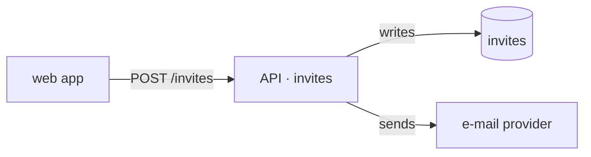

# Solution — Workspace invites

## In one picture

## The parts

| Part | Repo and path | Runs where | Does | req |
|---|---|---|---|---|
| invites use case | api: `internal/invites/` | api | creates, resends and accepts invites | J1.s2.1, J2.s1.1 |
| Invites page | web: `src/settings/invites/` | web app | the form and the pending list | J1.s2.1 |

## The screens

| Screen · state | Frame | Route and component | Data from |
|---|---|---|---|
| Invites · pending | `prototype/frames/invites.pending.png` | `/settings/invites` · `InvitesPage` | `GET /invites` |

**What the mock fakes:** nothing.

## The flows

### Send an invite (covers S-001)

Trigger: the admin submits the form.

1. The use case checks the caller is an admin of the workspace (req: floor:D7).
2. A member's e-mail returns `409 already_member` (req: J1.s2.2).
3. A pending invite for the same e-mail is resent, not duplicated (req: J1.s2.1).
4. Otherwise one `invites` row is written, status `pending`, expiry seven days (req: J1.s2.1).
5. The e-mail is sent, up to three tries in about five seconds.

| When | What the system does | What the user sees |
|---|---|---|
| the provider is down | the invite stays pending, a log line alarms | "not sent yet" |

### Accept an invite (covers S-002)

Trigger: the person opens the link.

1. The invite is found by its hashed token (req: J2.s1.1).
2. An expired or used invite returns `410 invite_expired` (req: J2.s1.2).
3. The member is added and the invite marked `accepted`, in one transaction (req: J2.s1.1).

## Security posture

- **Who can call what:** only an admin sends invites; checked in the use case.
- **Personal data:** the e-mail is stored, never logged.
- **Secrets:** the provider key lives in the secret manager.
- **Abuse:** none: the route is behind the admin's session.

## Decisions

> **Decision — where the e-mail is sent**
> Context: a background job or inside the request.
> Options: A) inside the request — nothing new · B) a background job — a queue and an alarm
> Chosen: A — a human can resend; the queue is the evolution path.

## Where the architect disagreed with the user

| He said | The architect proposed | Why | Settled |
|---|---|---|---|
| "send the e-mail from a background job" | inside the request, three tries | a human can resend | "inside the request is fine" |

## What changes if it grows

| Relaxed now | If this happens | Add | Cost |
|---|---|---|---|
| e-mail sent inside the request | more than 5% of sends fail in a day | a queue with a dead-letter alarm | 1 day |

## The implementer decides

- The wording of validation messages that are not business rules.

## References

- the doctrine's module layout
