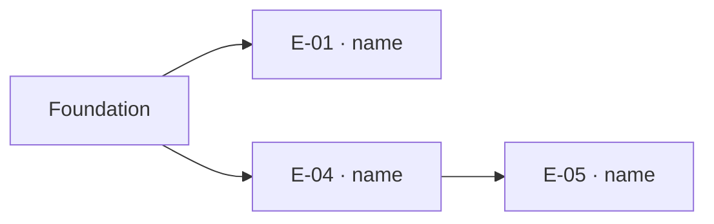

# Plan — <workstream> — from A to B

<!--
  Written by the CONDUCTOR, whole, once the user approved the cut. The
  writers never edit it; stage 4 fills the Status column as entries
  merge and writes the amendments.

  Three words: the FOUNDATION lays down once everything the entries
  would fight over (migrations, the contract and its generated code,
  the module registry, the shared pieces, the factories); an ENTRY is a
  story, or a small group that proves only together, built vertically
  (back, front, tests) in its own worktree; an EDGE exists only when an
  entry's proof needs another entry's behavior — data is seeded by the
  factories, never an edge. Everything with no edge is built at once,
  up to the cap.

  Decision blocks (house format) where the user chose between two
  cuts; the conductor's recommendation kept beside the choice.
-->

## From A to B

**A (today):** <one paragraph from recon/: what each area of the codebase has>
**B (the design):** <one paragraph: what exists when the last entry is merged>

## The foundation — `F`

<!-- built alone, first; after it no entry edits any of these files -->

| Kind | What |
|---|---|
| migration | <tables and columns, expansion only, with the data-model.md section> |
| contract | <every new or changed route in openapi.yaml; the generated code; routes answer 501 until their entry lands> |
| module | <new modules registered in the composition> |
| shared | <a component or helper two entries use, as the design names it> |
| factory | <one per entity the proofs seed> |

**Proof:** run `make verify` → expect `<exit 0; the new routes answer 501>`
**Brief:** `02-plan/briefs/F.md`

## The entries

| Id | Name | Stories | Builds (back · front) | After | Proof | Touches |
|---|---|---|---|---|---|---|
| E-01 | <name> | S-001 | <use case, route> · <screen> | — | run `<make target or spec>` → expect `<cases named>` | <module, screen> |
| E-05 | <name> | S-005 | <…> · — | E-04 (its test clicks <the button E-04 builds>) | <…> | <…> |

## The graph

**Steps:** <foundation, then N entries at once, then …> · **Concurrency cap:** <n> (<cores / memory measured>)

## Pre-flight

| Item | Entry | Status |
|---|---|---|
| <what the user hands over, and where it lives> | <E-nn or F> | handed · missing |

## Decisions

> **Decision — <title>**
> Context: <the cut in question>
> Options: A) <option — its cost> · B) <option — its cost>
> Recommended: <letter>
> Chosen: <letter> — <why, the user's words>

## Status

<!-- stage 4 fills: one line per entry as it merges: date · entry · sha · proof line -->

## Amendments

<!-- An entry, an edge or the foundation that changes while being built:
     date, what changed, why, in the user's words where he gave them.
     The sections above are edited in place; the amendment is the trail. -->
