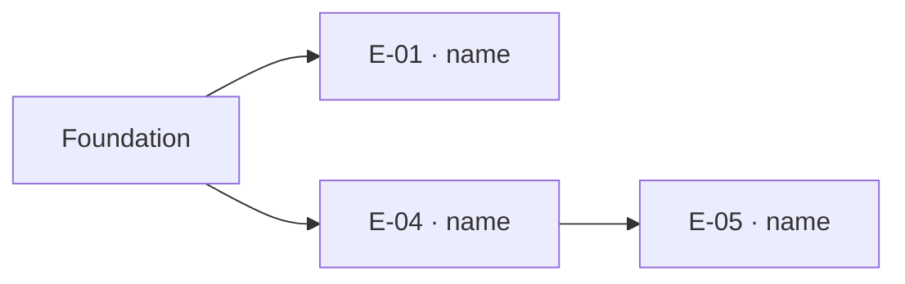

# Plan — <workstream> — from A to B

<!--
  Written by the CONDUCTOR, whole, once the user approved the cut. The
  writers never edit it; stage 4 fills the Status column as entries
  merge and writes the amendments.

  Three words: the FOUNDATION lays down once everything the entries
  would fight over (migrations, the contract and its generated code,
  the module registry, the shared pieces, the factories, the first
  exemplar of each new kind); an ENTRY is a story, or a small group
  that proves only together, built vertically (back, front, tests) by
  one builder in its own worktree; an EDGE exists only when an entry's
  proof needs another entry's behavior — data is seeded by the
  factories, never an edge. Everything with no edge is built at once,
  up to the cap. An edge held by one journey only is "stacked": the
  entry starts on the other's branch when that one is ready.

  After F, only the doctrine's shared files are frozen. Everything else
  F created, entries extend by addition, as each brief's "Extends"
  declares.

  Size is relative (S · M · L) and L is the cap; the critical path is
  the longest chain of sizes from the foundation to the last merge.
  The cap is the measured one in recon/machine.md.

  Decision blocks (house format) where the user chose between two
  cuts; the conductor's recommendation kept beside the choice.
-->

## From A to B

**A (today):** <one paragraph from recon/: what each area of the codebase has>
**B (the design):** <one paragraph: what exists when the last entry is merged>

## The foundation — `F`

<!-- built alone, first; after it no entry edits the frozen files (the
     doctrine's shared files); the rest is extended by addition -->

| Kind | What |
|---|---|
| migration | <tables and columns, expansion only, with the data-model.md section> |
| contract | <every new or changed route in the API contract; the generated code; routes answer 501 until their entry lands> |
| module | <new modules registered in the composition> |
| shared | <a component or helper two entries use, as the design names it> |
| factory | <one per entity the proofs seed; the fakes and the per-project test targets> |
| exemplar | <the first module, page or job of a kind the recon found no instance of, in the doctrine's full shape, without business behavior> |

**Frozen after F:** <the doctrine's shared files, by path>
**Proof:** run `<the gate command>` → expect `<exit 0; migrations from empty; the generated code compiles>` (no test pins a stub that an entry replaces)
**Serves every entry:** <checked by the entries' "Uses from the foundation" against F.md "Provides": the gaps the writers raised and how F absorbed them, one line each>
**Brief:** `02-plan/briefs/F.md`

## The entries

| Id | Name | Stories | Builds (back · front) | Size | After | Acceptance | Touches | Feature map |
|---|---|---|---|---|---|---|---|---|
| E-01 | <name> | S-001 | <use case, route> · <screen> | M | — | <n lines: the cases named> | <module, screen> | <rows> |
| E-05 | <name> | S-005 | <…> · — | S | E-04 (its test clicks <the button E-04 builds>) · stacked when one journey only | <…> | <…> | <rows> |

## The graph

```mermaid
flowchart LR
  F[Foundation] --> E01[E-01 · name]
  F --> E04[E-04 · name]
  E04 --> E05[E-05 · name]
```

**Critical path:** <F → E-nn → … → the last merge, with the sizes>
**Steps:** <foundation, then N entries at once, then …> · **Concurrency cap:** <n> (measured in `recon/machine.md`)

## Gate commands

<!-- Fixed once for every entry, from the recon's Commands; stage 4
     passes them to each builder. No brief repeats them. -->

<ordered list: the fast check · the affected tests against the feat · the structure check, as the doctrine names them>

## Pre-flight

| Item | Entry | Status |
|---|---|---|
| <what the user hands over, and where it lives> | <E-nn or F> | handed · missing |

Open decisions of doctrine or test, decided before stage 4:

| Decision | The options | Entries it touches | Decided |
|---|---|---|---|
| <a rule the entries lean on that the doctrine leaves open> | <A · B> | <E-nn> | <the choice, his words> |

## Decisions

> **Decision — <title>**
> Context: <the cut in question>
> Options: A) <option — its cost> · B) <option — its cost>
> Recommended: <letter>
> Chosen: <letter> — <why, the user's words>

## Status

<!-- stage 4 fills: one line per entry as it merges: date · entry · sha · proof line -->

## Amendments

<!-- An entry, an edge or the foundation that changes while being built:
     date, what changed, why, in the user's words where he gave them.
     The sections above are edited in place; the amendment is the trail. -->
